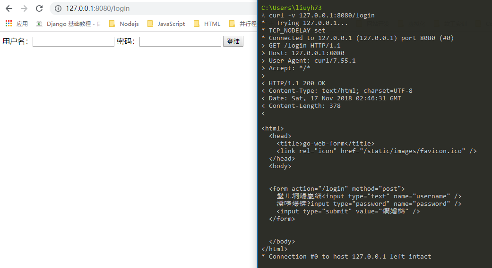
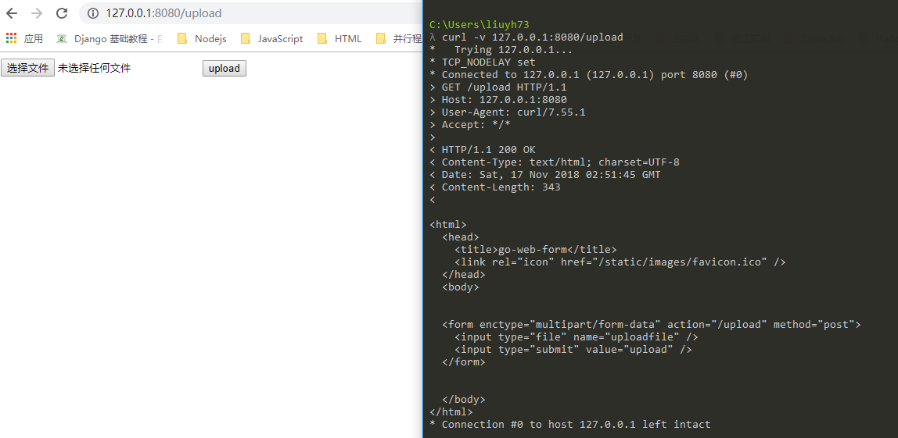
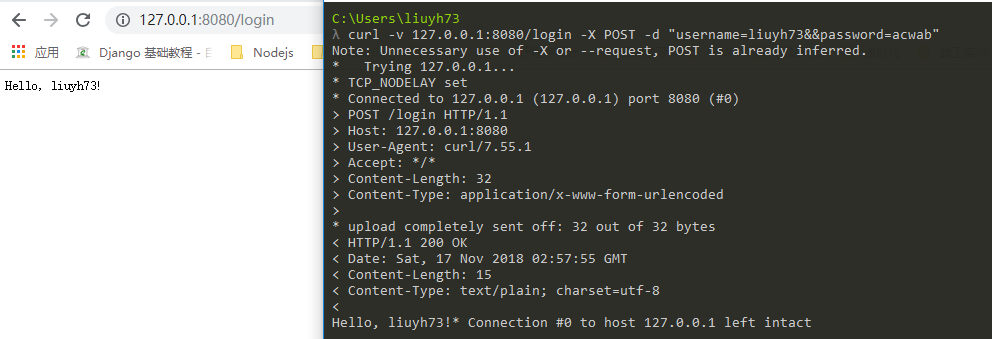
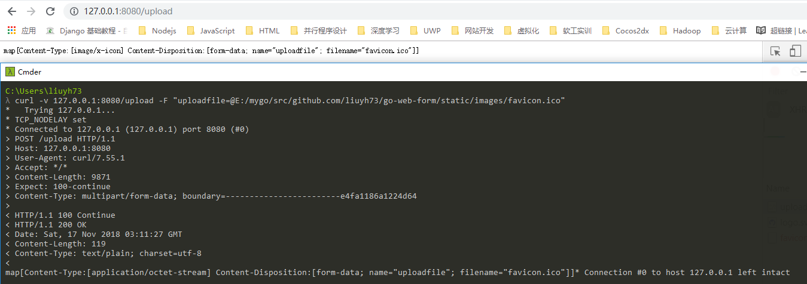
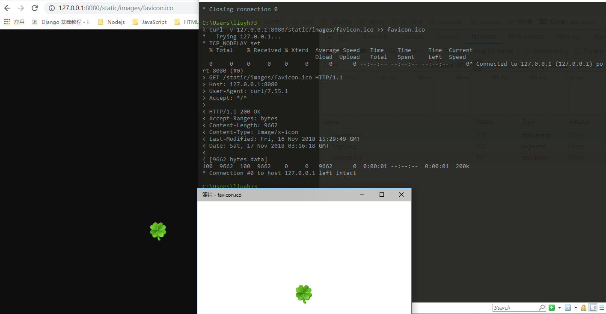
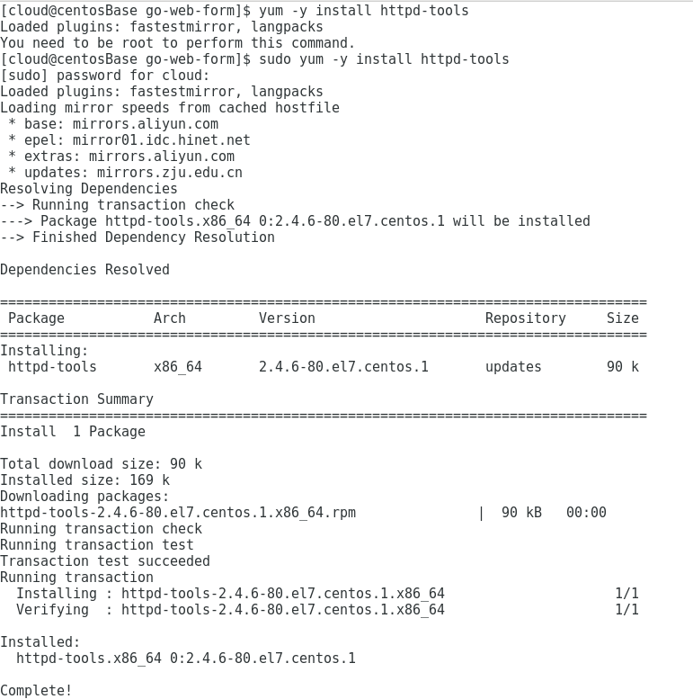
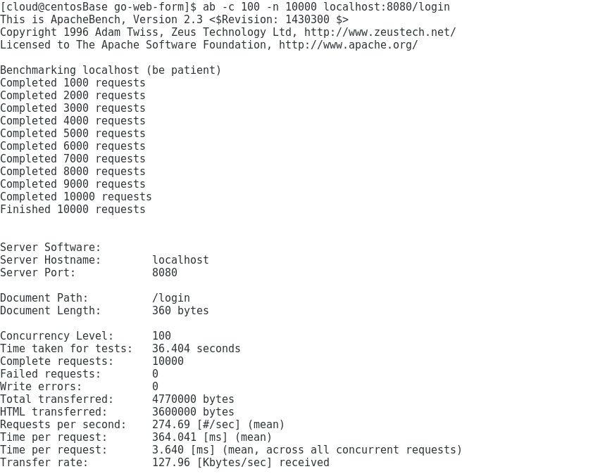
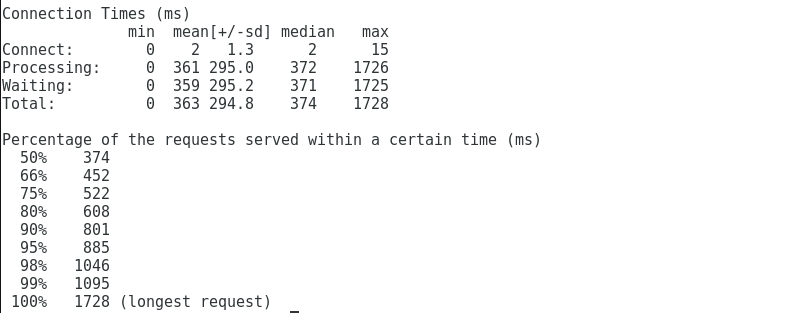

# go-web-form
## 目录结构
```bash
E:.
├─file(存储上传到的文件)
├─service(后台服务设计)
│   ├─router.go #路由
│   └─server.go #启动后台服务
├─static(静态资源)
│  └─images
│       └─favicon.ico
└─views(界面)
    ├─layout.gtpl #layout
    ├─login.gtpl  #login界面
    └─upload.gtpl #upload界面
```
## 运行结果
-   登录

-   上传文件

## curl测试
在Linux中curl是一个利用URL规则在命令行下工作的文件传输工具，可以说是一款很强大的http命令行工具。它支持文件的上传和下载，是综合传输工具，但按传统，习惯称url为下载工具。
常见参数介绍：
```
-A/--user-agent <string>          设置用户代理发送给服务器
-b/--cookie <name=string/file>    cookie字符串或文件读取位置
-c/--cookie-jar <file>            操作结束后把cookie写入到这个文件中
-C/--continue-at <offset>         断点续转
-D/--dump-header <file>           把header信息写入到该文件中
-e/--referer                      来源网址
-f/--fail                         连接失败时不显示http错误
-o/--output                       把输出写到该文件中
-O/--remote-name                  把输出写到该文件中，保留远程文件的文件名
-r/--range <range>                检索来自HTTP/1.1或FTP服务器字节范围
-s/--silent                       静音模式。不输出任何东西
-T/--upload-file <file>           上传文件
-u/--user <user[:password]>       设置服务器的用户和密码
-w/--write-out [format]           什么输出完成后
-x/--proxy <host[:port]>          在给定的端口上使用HTTP代理
-#/--progress-bar                 进度条显示当前的传送状态
```
-   `curl -v 127.0.0.1:8080/login` Method：GET

-   `curl -v 127.0.0.1:8080/upload` Method：GET

-   `curl -v 127.0.0.1:8080/login -X POST -d "username=liuyh73&&password=acwab"` Method：POST

-   `curl -v 127.0.0.1:8080/upload -F "uploadfile=@E:/mygo/src/github.com/liuyh73/go-web-form/static/images/favicon.ico"` Method：POST

-   `curl -v 127.0.0.1:8080/static/images/favicon.ico` Method: GET

## ab测试
-   安装压力测试工具`sudo yum -y install httpd-tools`

-   `ab -c 100 -n 10000 localhost:8080/login`


## service介绍
[传送门](./docs/service.md)
## views介绍
[传送门](./docs/views.md)